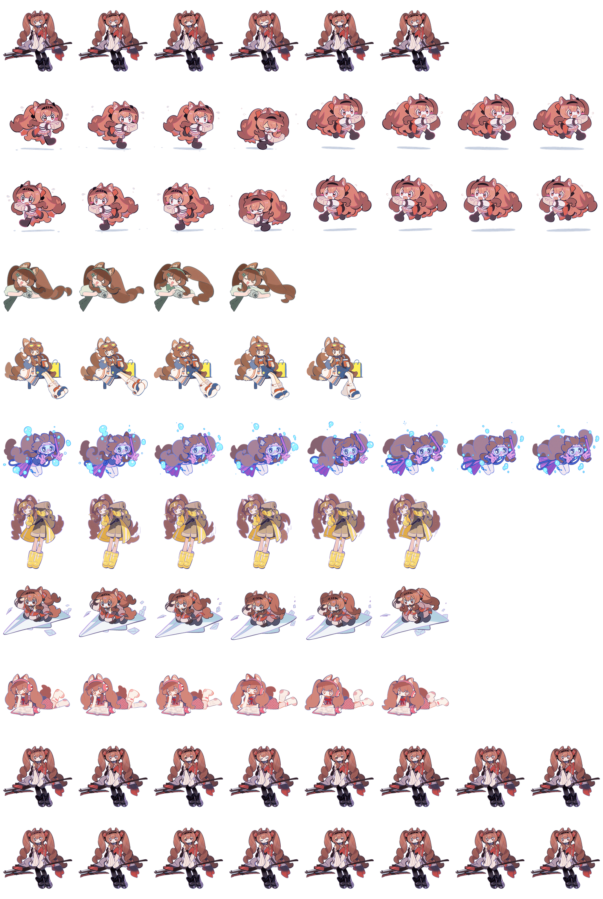

# mypet — Codex 桌面桌宠

一只会拍照、跑腿送文件的小助手桌宠，基于 Codex 桌宠 V2 规范（8 列 × 11 行，整图 1536×2288）。



## 安装（直接用，不用改）

1. 打开 `%USERPROFILE%\.codex\pets\` 目录（`C:\Users\<你的用户名>\.codex\pets\`）
2. 把本项目 `output/mypet/` 整个文件夹复制进去，得到 `...\.codex\pets\mypet\`
3. 重启 Codex 桌面端 → **设置 → Pets → 刷新列表** → 选中「测试桌宠」

## 从源码重建

```bash
npm install        # 安装 sharp（图像处理库）
node build.mjs     # 读取 素材/ 下的 GIF → 生成 output/mypet/spritesheet.webp
```

重跑后把 `output/mypet/` 按上面「安装」步骤复制即可生效。

## 素材与状态映射

`素材/` 下的 GIF 按文件名对应桌宠状态（改动画就替换同名文件再重建）：

| 源文件名 | 状态 | 含义 |
|---|---|---|
| `待机.gif` | idle | 待机（引擎唯一循环的状态） |
| `向右移动.gif` | running-right | 向右移动 |
| `向左移动.gif` | running-left | 向左移动 |
| `互动.gif` | waving | 互动 |
| `任务完成.gif` | jumping | 任务完成 |
| `任务失败.gif` | failed | 任务失败 |
| `等待确认{博士，这里有一份文件需要您确认}.gif` | waiting | 等待确认 |
| `工作中(送信).gif` | running | 工作中 |
| `检查中{思考.ing}.gif` | review | 检查中 |

`备选1.gif` / `备选2.gif` 是备选素材，目前未参与构建。

## 已知限制（实测确认）

- **每个动画最多 8 帧**（图集 8 列）。构建脚本按各状态规范帧数采样：待机 6、左右移动 8、挥手 4、跳跃 5、失败 8、等待/工作/检查 6，每行多出的格子保持透明，校验器不会报「未用但非透明」。
- **持续状态只播放一次动画后回落待机**（工作中 / 检查中 / 等待确认）。这是 Codex 引擎对自定义桌宠的固定行为，`pet.json` 无法配置循环——引擎内部有 `animations.loop` 字段但只对内置桌宠生效，加进自定义 pet.json 会导致桌宠无法加载。

## 项目结构

```
├── build.mjs          # 构建脚本（GIF → 图集）
├── 素材/               # 源 GIF（9 个状态 + 2 个备选）
└── output/mypet/
    ├── pet.json       # 桌宠配置（经典 V2 格式）
    ├── spritesheet.webp  # 1536×2288 图集
    ├── manifest.json  # 状态清单（文档）
    └── preview.png    # 预览图
```
