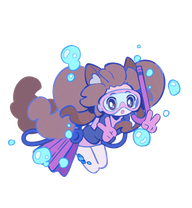
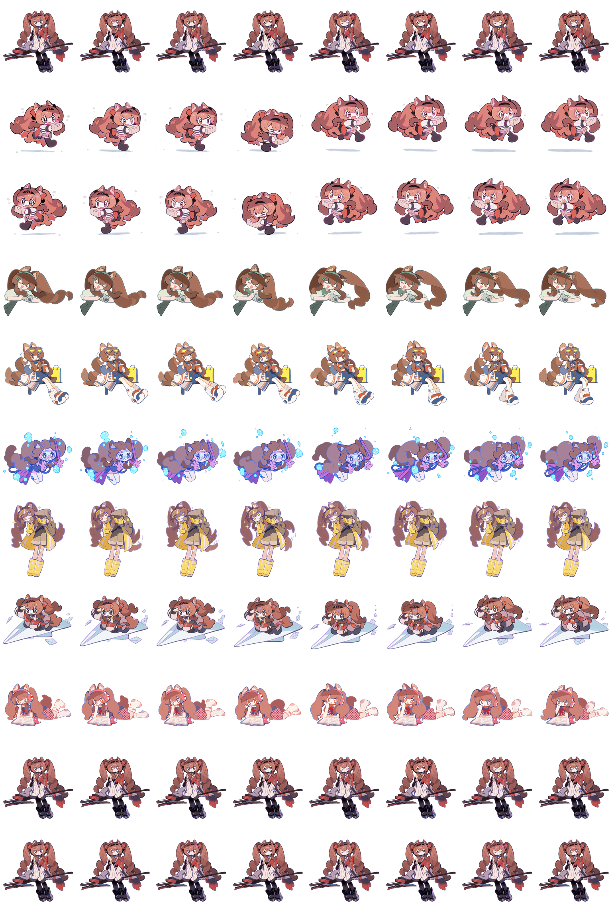

# 予愿安洁莉娜q版桌宠 — Codex 桌面桌宠

《明日方舟》角色「予愿安洁莉娜」Q 版形象的 Codex 桌面桌宠：一只可爱能陪伴你的洁哥，基于 Codex 桌宠 V2 规范（8 列 × 11 行，整图 1536×2288）。本项目所有资源素材均取自明日方舟官方公开素材。


## 动作图鉴

予愿安洁莉娜q版桌宠的每个动作由明日方舟官方公开素材整理，并输出为 `192 × 208` 的透明 PNG 单帧预览。先看动作，再看安装包：

<table>
  <tr>
    <td width="33%" align="center">
      
      <br><b>待机</b><br><sub><code>idle</code> · 呼吸与眨眼</sub>
    </td>
    <td width="33%" align="center">
      
      <br><b>向右移动</b><br><sub><code>running-right</code></sub>
    </td>
    <td width="33%" align="center">
      
      <br><b>向左移动</b><br><sub><code>running-left</code></sub>
    </td>
  </tr>
  <tr>
    <td align="center">
      
      <br><b>互动</b><br><sub><code>waving</code> · 互动反馈</sub>
    </td>
    <td align="center">
      
      <br><b>任务完成</b><br><sub><code>jumping</code> · 任务完成庆祝</sub>
    </td>
    <td align="center">
      
      <br><b>任务失败</b><br><sub><code>failed</code></sub>
    </td>
  </tr>
  <tr>
    <td align="center">
      
      <br><b>等待确认</b><br><sub><code>waiting</code> · 等待文件确认</sub>
    </td>
    <td align="center">
      
      <br><b>工作中</b><br><sub><code>running</code> · 送信跑腿</sub>
    </td>
    <td align="center">
      
      <br><b>检查中</b><br><sub><code>review</code> · 思考检查</sub>
    </td>
  </tr>
</table>

<details>
  <summary><b>查看完整动作图集</b></summary>
  <br>
  <p align="center">
    
  </p>
  <p align="center"><sub>每格为 192 × 208；第 0–8 行是标准动作，第 9–10 行是视线。</sub></p>
</details>

## 安装

本质只有一步：把 `output/mypet` 里的 **`pet.json` + `spritesheet.webp`** 放进 `%USERPROFILE%\.codex\pets\mypet\`（macOS 是 `~/.codex/pets/mypet/`）。下面三种方式任选其一。

> 注意：最终安装目录必须叫 **`mypet`**，不要直接把仓库根目录或 `output` 外层文件夹当作安装目录。`.codex` 是隐藏目录，但可以直接在资源管理器地址栏输入路径访问。

### 方式一：PowerShell 复制（推荐）

先把仓库 clone 或下载到本地，然后在 PowerShell 里执行（把 `$repoPath` 换成你本地的仓库路径）：

```powershell
$repoPath = "C:\path\to\mypet-codex-pet"          # 改成你的仓库路径
$petDir   = Join-Path ([Environment]::GetFolderPath("UserProfile")) ".codex\pets\mypet"
New-Item -ItemType Directory -Force -Path $petDir | Out-Null
Copy-Item "$repoPath\output\mypet\pet.json"         $petDir -Force
Copy-Item "$repoPath\output\mypet\spritesheet.webp" $petDir -Force
```

检查安装结果：

```powershell
Get-Item "$petDir\pet.json", "$petDir\spritesheet.webp"
```

### 方式二：手动拖拽

1. 在资源管理器地址栏输入 `%USERPROFILE%\.codex\pets\mypet\` 回车；目录不存在就先创建
2. 把仓库 `output/mypet/` 里的 `pet.json` 和 `spritesheet.webp` 拖进这个目录
3. 最终目录结构应为：

```
C:\Users\你的用户名\.codex\pets\mypet\
├── pet.json
└── spritesheet.webp
```

`output/mypet` 里的 `manifest.json`、`preview.png` 只是文档和预览图，Codex 不需要，可拷可不拷。

### 方式三：让 Agent 自动安装

如果你用的 Agent 具备网络和本机文件读写权限，把下面这段提示词交给它（先确认已允许它操作本机文件）：

> 请帮我在这台电脑上安装 GitHub 仓库 https://github.com/leanyu165-gif/mypet-codex-pet 的 Codex 原生 v2 桌宠「予愿安洁莉娜q版桌宠」。
>
> 1. 识别当前系统是 macOS 还是 Windows。
> 2. 用 `git clone` 或下载源码把仓库拿到本地。
> 3. 找到 `output/mypet/` 里的 `pet.json` 和 `spritesheet.webp`，不要把仓库根目录或 `output` 外层文件夹当安装目录。
> 4. 创建桌宠目录：macOS 为 `~/.codex/pets/mypet/`，Windows 为 `%USERPROFILE%\.codex\pets\mypet\`。
> 5. 只把这两个文件复制进去；不要删除或修改其他桌宠文件。
> 6. 检查 `pet.json` 里的 `id` 是否为 `mypet`，并确认 `spritesheet.webp` 存在且可读取。
> 7. 若目标目录已有同名文件，先报告并询问是否覆盖，不要擅自删除其他文件。
> 8. 完成后告诉我实际安装路径、检查结果，并提醒我重新打开 Codex，到「设置 → Pets」刷新列表后选择「予愿安洁莉娜q版桌宠」。
> 9. 如果 Windows 下刷新后仍看不到，先检查 Codex 是否在使用 WSL 后端（见文末「故障排查」），不要修改 pet.json、不要转 v1、不要重画图集。

## macOS

本仓库跨平台，macOS 用户执行（把 `$repoPath` 换成实际路径）：

```bash
mkdir -p ~/.codex/pets/mypet
cp "$repoPath/output/mypet/pet.json"         ~/.codex/pets/mypet/
cp "$repoPath/output/mypet/spritesheet.webp" ~/.codex/pets/mypet/
```

## 从源码重建

想改动画或参与开发时用：

```bash
npm install        # 安装 sharp（图像处理库）
node build.mjs     # 读取 素材/ 下的 GIF → 生成 output/mypet/spritesheet.webp
```

重跑后按上面的任一方式把新 `output/mypet` 覆盖复制即可生效。

## 完成安装

重新打开 Codex（Windows 建议从系统托盘**完整退出**，只关窗口可能没结束后台进程），前往 **设置 → Pets → 刷新列表**，选择「**予愿安洁莉娜q版桌宠**」。

## 故障排查：Windows 刷新后看不到宠物

如果 `pet.json` 和 `spritesheet.webp` 都放对了、`id` 也是 `mypet`，刷新后仍看不到，可能是 Codex Desktop 用了 **WSL 后端**——该场景下 Codex 可能无法发现已正确安装的自定义桌宠（上游问题：[openai/codex#20730](https://github.com/openai/codex/issues/20730)）。

临时处理：在 Codex 设置里把任务执行后端切到 Windows 原生模式 → 从系统托盘完整退出 → 重启 → 刷新 Pets 列表。集成终端仍可继续用 WSL。

> 这只影响桌宠能否被 Codex 发现，**不代表资源包格式有问题**。请勿为了绕过它而把资源转成 v1、修改 `pet.json` 或重画 `spritesheet.webp`。

## 素材与状态映射

`素材/` 下的 GIF 按文件名对应桌宠状态（改动画就替换同名文件再重建）：

| 源文件名 | 状态 | 含义 |
|---|---|---|
| `待机.gif` | idle | 待机（引擎唯一循环的状态） |
| `向右移动.gif` | running-right | 向右移动 |
| `向左移动.gif` | running-left | 向左移动 |
| `互动.gif` | waving | 互动 |
| `任务完成.gif` | jumping | 任务完成 |
| `任务失败.gif` | failed | 任务失败 |
| `等待确认{博士，这里有一份文件需要您确认}.gif` | waiting | 等待确认 |
| `工作中(送信).gif` | running | 工作中 |
| `检查中{思考.ing}.gif` | review | 检查中 |

`备选1.gif` / `备选2.gif` 是备选素材，目前未参与构建。

## 已知限制（实测确认）

- **每个动画最多 8 帧**（图集 8 列）。构建脚本按各状态规范帧数采样：待机 6、左右移动 8、挥手 4、跳跃 5、失败 8、等待/工作/检查 6，每行多出的格子保持透明，校验器不会报「未用但非透明」。
- **持续状态只播放一次动画后回落待机**（工作中 / 检查中 / 等待确认）。这是 Codex 引擎对自定义桌宠的固定行为，`pet.json` 无法配置循环——引擎内部有 `animations.loop` 字段但只对内置桌宠生效，加进自定义 pet.json 会导致桌宠无法加载。

## 项目结构

```
├── build.mjs          # 构建脚本（GIF → 图集 + 单帧预览）
├── 素材/               # 源 GIF（9 个状态 + 2 个备选）
├── 表情包单张预览/      # 9 个动作的透明 PNG 单帧预览（build.mjs 自动生成）
└── output/mypet/
    ├── pet.json       # 桌宠配置（经典 V2 格式）
    ├── spritesheet.webp  # 1536×2288 图集
    ├── manifest.json  # 状态清单（文档）
    └── preview.png    # 预览图
```

## 版权与声明

本项目是非官方、非商业的个人同人衍生项目，与鹰角网络（Hypergryph）、《明日方舟》（Arknights）及相关官方活动不存在隶属、合作、赞助或背书关系。

角色「予愿安洁莉娜」及其视觉、动作素材来源于鹰角网络《明日方舟》官方公开素材。原始素材及相关知识产权归鹰角网络及其他相关权利人所有；本项目不主张拥有这些原始素材的版权，也未获得其商业授权。部分动作经过人工整理、编辑和 Codex AI 辅助生成，属于基于官方素材的衍生内容。

本项目仅用于个人学习、非商业展示与技术研究。不得将含有上述衍生素材的桌宠包、GIF、精灵图或宣传图出售、商业授权，或用于暗示官方关联的用途。

完整来源和权利边界见 [NOTICE.md](./NOTICE.md)。对于本项目作者有权许可的部分，非商业署名使用说明见 [ASSET-USAGE.md](./ASSET-USAGE.md)；该说明不构成对鹰角网络官方素材的通用再授权。
